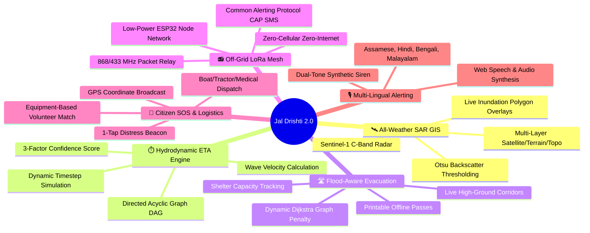
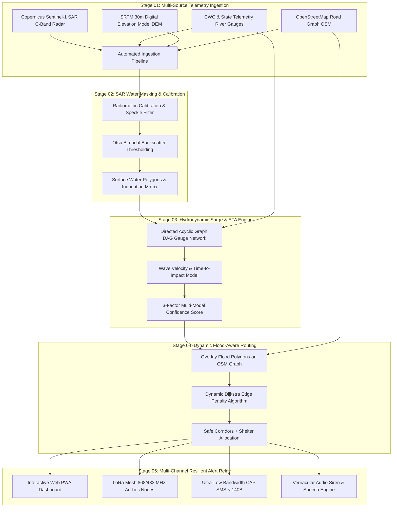

# 🌊 Jal Drishti 2.0 (जल दृष्टि) — Multi-Modal Flood Early Warning & Resilient Evacuation System

<div align="center">

[](https://www.sih.gov.in/)
[]()
[](https://react.dev/)
[](https://vitejs.dev/)
[](https://tailwindcss.com/)
[](https://leafletjs.com/)
[]()

**An AI & Sentinel-1 SAR active radar-powered flood intelligence platform that translates upstream telemetry into hyper-localized impact ETAs, dynamic flood-aware evacuation corridors, vernacular voice sirens, and off-grid LoRa mesh broadcasts.**

[Overview](#-executive-summary) • [Key Capabilities](#-key-capabilities) • [System Architecture](#-system-architecture--data-flow) • [Mathematical Models](#-mathematical--algorithmic-formulations) • [Hardware & LoRa Spec](#-hardware-spec--off-grid-telecom-architecture) • [Getting Started](#-installation--local-setup) • [SIH 2026 Matrix](#-competitive-benchmark-matrix)

</div>

---

## 📌 Executive Summary

Every monsoon season across India—specifically in the flood-prone basins of the **Brahmaputra (Assam)**, **Kosi & Bagmati (Bihar)**, and **Chaliyar & Kabini (Kerala)**—millions of citizens face sudden inundation. Despite significant advances in hydrological modeling, high casualty rates and severe displacement persist due to **five systemic blind spots** in conventional disaster management:

1. **Optical Satellite Blindness**: Conventional satellites (*Landsat, Sentinel-2, MODIS*) use optical sensors that **cannot penetrate dense monsoon cloud cover** during peak rainfall events.
2. **Abstract Sensor Telemetry**: Government bulletins report abstract river elevations (e.g., *"Pandu Gauge at 50.45m"*), which fail to answer the critical questions citizens ask: *"When will floodwaters hit my doorstep?"* and *"Which roads are dry right now?"*
3. **Static & Submerged Evacuation Paths**: Navigation apps recommend standard shortest routes that lead fleeing families directly into submerged bridges, washed-out culverts, and flood choke points.
4. **Telecom & Power Grid Collapse**: Cellular towers (4G/5G) and power grids fail within minutes of riverbank breaches, cutting off internet-dependent emergency alerts.
5. **Linguistic & Accessibility Barriers**: Text-heavy PDF bulletins published in English or Hindi fail to reach non-literate and vernacular-speaking rural communities.

**Jal Drishti 2.0 (जल दृष्टि)** is an end-to-end, multi-modal disaster intelligence and life-safety platform built to eliminate these failure points. By fusing **cloud-penetrating Sentinel-1 SAR C-band microwave radar** with **Central Water Commission (CWC) telemetry networks** through a **hydrodynamic surge wave propagation model**, Jal Drishti translates satellite backscatter and gauge sensors into **citizen-actionable survival intelligence**.

---

## 🌟 Key Capabilities



### 1. 🛰️ All-Weather Cloud-Penetrating SAR Radar GIS Map
- **Sentinel-1 C-Band Active Radar (10m Resolution)**: Operates at $5.405\text{ GHz}$, unaffected by cloud cover, torrential rains, or nighttime conditions.
- **Automated Water Masking**: Applies Otsu bimodal segmentation on VV/VH cross-polarization backscatter matrices to isolate specular surface reflections of flood water.
- **Interactive GIS Dashboard**: Real-time Leaflet GIS mapping with responsive layer toggling: live flood inundation masks, upstream gauge telemetry pins, relief shelters, and dynamic evacuation vectors.

### 2. ⏱️ Hydrodynamic Wave Propagation & ETA Engine
- **Localized Time-to-Impact Countdown**: Translates upstream river surges into clear, actionable countdown timers (*e.g., "Flood crest 4.8 km upstream — Arriving in 1.8 hours at 3.2 km/h"*).
- **DAG River Telemetry Network**: Models river stations as Directed Acyclic Graphs (DAGs), computing flood wave velocity ($v_{\text{surge}}$) and discharge volume transit times.
- **3-Factor Multi-Modal Confidence Score**: Fuses SAR Radar classification (60%), upstream gauge concordance (25%), and SRTM 30m Digital Elevation Model (DEM) slope (15%).

### 3. 🛣️ Dynamic Flood-Aware Safe Evacuation Routing
- **Inundation-Aware Dijkstra / A\* Pathfinding**: Real-time edge cost penalties automatically block submerged roads, bridges, and washed-out culverts.
- **Multi-Route Comparative Analysis**: Evaluates routes categorized as **Safe** (green highway corridors), **Caution** (low embankments), and **Blocked** (inundated).
- **Shelter Staging & Capacity Management**: Live monitoring of relief camp capacities, elevation above mean sea level (MSL), on-site medical staff, drinking water tanks, and NDRF staging posts.
- **Printable Offline Emergency Evacuation Pass**: One-click printable and downloadable offline travel pass complete with scannable QR verification code, assigned shelter directions, and a survival checklist.

### 4. 📻 Off-Grid Resilient LoRa Mesh Network (868/433 MHz)
- **Zero-Cellular Multi-Hop Mesh Topology**: Operates on sub-GHz ISM bands (868.1–868.5 MHz in India / 433 MHz) to relay emergency packets when cell towers collapse.
- **Ad-Hoc Network Nodes**: Connects Village Panchayat Gateways, Upstream Gauge Repeaters, High-Ground Hilltop Relays, and Shelter Base Stations across 12+ km line-of-sight hops.
- **Ultra-Low-Bandwidth CAP SMS Broadcast**: Formats critical alerts into standard Common Alerting Protocol (CAP) compressed SMS packets (< 140 bytes / < 1 KB payload).

### 5. 🤝 Citizen SOS Distress & Volunteer Resource Dispatch
- **1-Tap SOS Distress Beacon**: Transmits pinpoint GPS coordinates, headcount of trapped persons, and critical emergency needs (rescue boat, baby milk, anti-venom, infant care).
- **Automated Resource Matcher**: Connects distress beacons with verified civilian volunteers and NDRF personnel filtered by specialized gear:
  - 🚤 Inflatable motorized rescue boats & life jackets
  - 🚜 4x4 high-clearance tractors & transport trolleys
  - 🩺 Emergency trauma kits & anti-venom supplies
  - 💧 500L mobile clean drinking water tankers & rations

### 6. 🎙️ Vernacular Dual-Tone Siren & Multi-Lingual Audio Dispatch
- **5 Native Languages**: Real-time synthesized audio and text alerts in **Assamese (অসমীয়া), Hindi (हिन्दी), Bengali (বাংলা), Malayalam (മലയാളം), and English (EN)**.
- **Synthetic Emergency Siren**: Generates realistic dual-tone audio warnings ($880\text{ Hz} \leftrightarrow 440\text{ Hz}$) via the browser's native Web Audio API oscillator—zero external audio file dependencies.

### 7. 🏆 SIH 2026 Jury Pitch & Technical Inspector Mode
- **Built-in Hackathon Presentation Suite**: Direct access to Problem Statement 26192 alignment documentation, competitive benchmark matrix vs. CWC/IMD & Google Flood Hub, hardware cost feasibility analysis (< ₹1,400 per node), and the interactive 5-stage pipeline inspector.

---

## 🏗️ System Architecture & Data Flow



---

## 📐 Mathematical & Algorithmic Formulations

### 1. Hydrodynamic Flood Wave Velocity & Arrival ETA
The flood wave traveling down a river channel network is modeled using kinematic wave approximation:

$$v_{\text{surge}} = \frac{d(S_{\text{upstream}},\, S_{\text{target}})}{t(h_{\text{peak,\,upstream}}) - t(h_{\text{peak,\,target}})}$$

Where:
- $d(S_u, S_t)$ is the river channel distance between upstream gauge station $S_u$ and target village $S_t$.
- $t(h_{\text{peak}})$ is the recorded timestamp of the peak discharge / danger mark breach.

The localized time-to-impact countdown ($t_{\text{ETA}}$) is dynamically computed as:

$$t_{\text{ETA}} = \max\left(0,\, \frac{d_{\text{crest}}}{v_{\text{surge}}} - \Delta t_{\text{elapsed}}\right)$$

### 2. Multi-Modal Verification Confidence Score
To eliminate false alarms while guaranteeing zero undetected flood waves, Jal Drishti computes a weighted 3-factor concordance score:

$$C_{\text{final}} = w_1 \cdot C_{\text{SAR}} + w_2 \cdot C_{\text{Gauge}} + w_3 \cdot C_{\text{DEM}}$$

$$\text{Where: } w_1 = 0.60,\quad w_2 = 0.25,\quad w_3 = 0.15 \quad \left(\sum w_i = 1.0\right)$$

- $C_{\text{SAR}}$: Percentage certainty of specular reflection backscatter drop ($\sigma^0_{\text{water}} \le -16\text{ dB}$).
- $C_{\text{Gauge}}$: Percentage concordance of upstream river sensors exceeding warning/danger levels ($h \ge h_{\text{danger}}$).
- $C_{\text{DEM}}$: Topographic slope index derived from 30m SRTM DEM indicating low-lying catchment accumulation.

### 3. Dynamic Inundation-Aware Dijkstra Pathfinding
To find the safest evacuation route $P^*$ from village origin $V_0$ to relief shelter $S_k$:

$$P^* = \arg\min_P \sum_{e \in P} \text{Cost}(e)$$

$$\text{Cost}(e) = \text{Length}(e) \times \left( 1 + \alpha \cdot \mathbb{I}_{\text{submerged}}(e) + \beta \cdot \max\left(0,\, \frac{E_{\text{critical}} - \text{Elevation}(e)}{E_{\text{critical}}}\right) \right)$$

Where:
- $\mathbb{I}_{\text{submerged}}(e) = 1$ if edge $e$ intersects the SAR flood mask polygon, triggering an edge penalty $\alpha = 10^5$ (effectively pruning the edge).
- $\beta$ is the elevation risk penalty weight discouraging low-ground routes during rising flood tides.

### 4. Otsu Bimodal SAR Backscatter Thresholding
Active C-band microwave pulses hit smooth floodwater and reflect away from the sensor (*specular reflection*), yielding dark pixels with very low backscatter $\sigma^0$ (typically $-22\text{ dB}$ to $-16\text{ dB}$). The optimal threshold $T^*$ separating water from dry terrain maximizes inter-class variance:

$$\sigma_B^2(T) = \omega_0(T)\,\omega_1(T)\,\left[\mu_0(T) - \mu_1(T)\right]^2$$

$$T^* = \arg\max_T \sigma_B^2(T)$$

---

## 📁 Repository Structure

The workspace contains both the initial MVP prototype (`jal-drishti`) and the complete 2.0 system (`jal-drishti-v2`):

```
fuzzy-barnacle/
├── README.md                           # Master Project Documentation
├── .gitignore                          # Workspace gitignore rules
│
├── jal-drishti-v2/                     # ⭐ Jal Drishti 2.0 (Comprehensive Release)
│   ├── index.html                      # HTML5 Entry Point with Font & GIS styling
│   ├── package.json                    # Dependencies (React 18, Leaflet, Recharts, Wouter, Tailwind v3)
│   ├── vite.config.js                  # Vite Build Configuration
│   ├── tailwind.config.js              # Custom Hydro Theme & Neon Palette Config
│   ├── postcss.config.js               # PostCSS Autoprefixer Setup
│   ├── README.md                       # V2 Quick Reference
│   │
│   └── src/
│       ├── main.jsx                    # Application Bootstrap
│       ├── App.jsx                     # Root Component & Layout
│       ├── index.css                   # Tailwind Global Directives & Glassmorphism Styles
│       │
│       ├── context/
│       │   └── AppStateContext.jsx     # Global State (Village, Sim Step, Audio, SOS, Passes)
│       │
│       ├── hooks/
│       │   └── useAudioAlert.js        # Web Audio API Siren Generator & Web Speech Dispatcher
│       │
│       ├── data/
│       │   ├── regionsData.js          # Multi-State Datasets (Assam, Bihar, Kerala)
│       │   ├── loraNodesData.js        # LoRa Mesh Node Topology & Packet Telemetry
│       │   ├── mockVolunteers.js       # Verified Volunteer & Active Distress SOS Records
│       │   └── simulationTimeline.js   # 5-Stage Hydrodynamic Progression Timeline (T+0h to T+12h)
│       │
│       ├── components/
│       │   ├── common/
│       │   │   ├── Header.jsx          # Live Alert Ticker, Audio Toggle & Nav Bar
│       │   │   ├── Footer.jsx          # System Telemetry Status & SIH Attribution
│       │   │   ├── Badge.jsx           # Reusable Glow Badge UI Component
│       │   │   └── LanguageSwitcher.jsx# 5-Language Selector with Instant Audio Sync
│       │   │
│       │   ├── detection/
│       │   │   ├── RegionSelector.jsx  # Cascading State -> District -> Village Switcher
│       │   │   ├── EtaCountdownCard.jsx# Hydrodynamic Impact Countdown & Multi-Factor Confidence
│       │   │   ├── RiverGaugeChart.jsx # Recharts 24h Gauge Level vs. Danger Mark + Projection
│       │   │   └── UpstreamNetworkGraph.jsx # DAG Visualizer for Upstream Telemetry Stations
│       │   │
│       │   ├── map/
│       │   │   ├── FloodMapLeaflet.jsx # Leaflet GIS Map with Live Flood Polygon Masks & Pins
│       │   │   └── SimulationControls.jsx # Dynamic T+0h to T+12h Flood Progression Slider
│       │   │
│       │   ├── evacuation/
│       │   │   ├── SafeRouteNavigator.jsx # Route Comparison (Safe, Caution, Blocked)
│       │   │   ├── ShelterCapacityCard.jsx# Relief Camp Facilities, Capacity & Commander Details
│       │   │   └── OfflinePassModal.jsx   # Printable/Downloadable Offline Pass with QR Code
│       │   │
│       │   ├── lora/
│       │   │   ├── LoRaMeshSimulator.jsx  # Multi-Hop Packet Relay Visualizer (RSSI, SNR, Hops)
│       │   │   └── LowBandwidthSmsView.jsx# CAP Protocol SMS Broadcast Preview (< 140 Bytes)
│       │   │
│       │   ├── volunteer/
│       │   │   ├── VolunteerMatcher.jsx   # Equipment-Based Volunteer & NDRF Resource Matcher
│       │   │   └── SosBeaconModal.jsx     # 1-Tap Citizen Distress Beacon Dispatcher
│       │   │
│       │   └── presentation/
│       │       └── JuryPitchMode.jsx      # SIH 2026 Competitive Benchmark & 5-Stage Architecture
│       │
│       └── pages/
│           ├── DashboardPage.jsx       # Real-Time Monitoring & Detection Command Center
│           ├── EvacuationPage.jsx      # Safe Corridors, Evacuation Routing & Shelter Logistics
│           ├── ResilientCommsPage.jsx  # LoRa Mesh Simulation & Low-Bandwidth SMS Console
│           ├── SosVolunteerPage.jsx    # Citizen SOS Dispatch & Volunteer Management Hub
│           └── JuryPitchPage.jsx       # SIH 2026 Hackathon Jury Pitch & Technical Inspector
│
└── jal-drishti/                        # 📦 Jal Drishti 1.0 (Initial Prototype)
    ├── package.json                    # React 19 + TanStack Router + Tailwind v4
    ├── vite.config.js                  # Vite Config with TanStack Router Plugin
    └── src/                            # Modular Route Components
```

---

## 🗺️ Supported High-Risk Flood Plains

Jal Drishti 2.0 is pre-configured with authentic geographic, hydrological, and shelter datasets for high-risk flood zones across India:

| State | River Basin | District | Village / Hotspot | Monitored Upstream Gauge Stations |
| :--- | :--- | :--- | :--- | :--- |
| **Assam** | Brahmaputra Basin | **Kamrup** | **Palasbari** (পলাশবাৰী) | Pandu Gauge (50.45m), Chandrapur Node (54.20m), Goalpara Post (35.80m) |
| **Assam** | Brahmaputra / Borolia | **Kamrup** | **Hajo** (হাজো) | Hajo Bridge Sensor (42.10m) |
| **Assam** | Manas & Beki Basin | **Barpeta** | **Barpeta Road** (বৰপেটা ৰোড) | Beki River Railway Bridge Station (46.20m) |
| **Bihar** | Kosi & Bagmati Basin | **Darbhanga** | **Benipur** (बेनीपुर) | Jhanjharpur Gauge Post (52.80m) |
| **Kerala** | Chaliyar & Kabini Basin | **Wayanad** | **Meppadi** (മേപ്പാടി) | Chooralmala Hydro-Telemetry Post (14.80m) |

---

## 📻 Hardware Spec & Off-Grid Telecom Architecture

When catastrophic floods strike, telecommunication towers and power substations are frequently knocked offline. Jal Drishti 2.0 integrates an ultra-low-cost, off-grid LoRa Mesh network to maintain communications:

<div align="center">

```
  [Citizen Handheld Node] ──(1-Hop LoRa)──> [Panchayat Gateway Node]
                                                    │
                                             (Multi-Hop Mesh)
                                                    ▼
 [Upstream Gauge Repeater] ──(868 MHz)──> [High-Ground Ridge Repeater]
                                                    │
                                             (Line-of-Sight)
                                                    ▼
                                       [Shelter Base Station Node]
                                                    │
                                          [NDRF Command Laptop]
```

</div>

### Hardware Bill of Materials (BOM) per Node

| Component | Specification | Function | Approx. Cost (INR) |
| :--- | :--- | :--- | :--- |
| **Microcontroller + Radio** | ESP32 + Semtech SX1276 LoRa | 240 MHz Dual-Core, 868/433 MHz Transceiver | ₹850 |
| **Power Storage** | 3.7V 3400mAh 18650 Li-ion Cell | 48+ Hours Autonomous Battery Operation | ₹220 |
| **Solar Harvesting** | 5V 5W Monocrystalline Panel + TP4056 | Continuous Daytime Trickle Charging | ₹250 |
| **Antenna** | 868 MHz 5dBi High-Gain Omnidirectional | 12+ km Line-of-Sight Transmission Range | ₹80 |
| **Enclosure** | IP67 Weatherproof Junction Box | Waterproof Flood-Resistant Housing | ₹70 |
| **Total Unit Cost** | — | — | **< ₹1,470 ($17.50 USD)** |

### Compressed CAP Packet Format (< 32 Bytes)
To maximize LoRa link budget and ensure rapid mesh packet forwarding across congested disaster zones:

```
┌───────────────┬──────────────┬───────────────┬────────────────┬────────────────────────┐
│ Header (2B)   │ Msg Type(1B) │ Village ID(4B)│ ETA Minutes(2B)│ GPS Latitude/Long (8B) │
│ 0x4A 0x44     │ 0x01 (ALERT) │ 0x41532D3031  │ 0x006C (108m)  │ 26.1280 N, 91.5340 E   │
└───────────────┴──────────────┴───────────────┴────────────────┴────────────────────────┘
```

---

## ⚡ Installation & Local Setup

### Prerequisites
- **Node.js**: `v18.0.0` or higher (Recommended: Node.js LTS)
- **npm**: `v9.0.0` or higher (or `pnpm` / `yarn`)
- Modern web browser with Web Audio API and Web Speech API support (Google Chrome, Microsoft Edge, Firefox, Safari)

---

### Running Jal Drishti 2.0 (Recommended Full Release)

```bash
# 1. Clone the repository
git clone https://github.com/chirag-dua123/fuzzy-barnacle.git

# 2. Navigate to the v2 directory
cd fuzzy-barnacle/jal-drishti-v2

# 3. Install dependencies
npm install

# 4. Start the local development server
npm run dev
```

The application will be accessible at:
👉 **`http://localhost:3000`** (or `http://localhost:5173`)

#### Available Scripts in `jal-drishti-v2`:
- `npm run dev`: Starts the Vite development server with Hot Module Replacement (HMR).
- `npm run build`: Compiles optimized production bundle into the `dist/` directory.
- `npm run preview`: Previews the production build locally.

---

### Running Jal Drishti 1.0 (MVP Prototype)

```bash
# Navigate to the v1 directory
cd fuzzy-barnacle/jal-drishti

# Install dependencies
npm install

# Start development server
npm run dev
```

The v1 application will be accessible at:
👉 **`http://localhost:5173`**

---

## ⚔️ Competitive Benchmark Matrix

| Capability / Metric | ★ **Jal Drishti 2.0** (Proposed) | **Current CWC / IMD System** | **Google Flood Hub** |
| :--- | :--- | :--- | :--- |
| **All-Weather Cloud Penetration** | **Yes (Sentinel-1 C-Band active SAR radar backscatter)** | No (Optical satellite imagery blocked by monsoon clouds) | Partial (Relies on optical imagery and static ML models) |
| **Citizen-Actionable Metric** | **Precise Local ETA (*"Surge arriving in 1.8h at 3.2 km/h"* )** | Raw gauge height (*"50.45m"* — Confusing for citizens) | Broad probability tier (*Low / Medium / High*) |
| **Flood-Aware Safe Evacuation Routing** | **Dynamic Dijkstra auto-blocking inundated roads** | None (Citizens left to guess dry routes) | Standard traffic routing without flood inundation masks |
| **Off-Grid Disaster Telecom** | **868/433 MHz LoRa Mesh Network (Zero cellular/internet needed)** | Requires active 4G/5G mobile tower networks | Web/Internet connection mandatory |
| **Multi-Lingual Voice & Siren** | **5 Languages (Assamese, Hindi, Bengali, Malayalam, EN) + Dual-Tone Siren** | English/Hindi PDF bulletins on government portals | Standard text notifications |
| **Citizen Distress & Logistics** | **1-Tap GPS SOS + Equipment-Matched Volunteer Dispatch** | Toll-free telephone numbers (often congested or down) | None |
| **Offline Evacuation Pass** | **Printable/Downloadable Pass with QR code validation** | None | None |
| **Deployment Cost** | **< ₹1,470 per solar-powered LoRa node** | Heavy capital expenditure telemetry stations | Cloud infrastructure dependent |

---

## 🛠️ Tech Stack & Libraries

### Frontend Architecture & State
- **Core Framework**: [React](https://react.dev/) (v18.3 in v2, v19.2 in v1)
- **Build Tooling**: [Vite](https://vitejs.dev/) (Lightning-fast HMR and optimized bundling)
- **Routing**: [Wouter](https://github.com/molefrog/wouter) (Ultra-lightweight state-synchronized routing in v2) / [TanStack Router](https://tanstack.com/router) (File-based routing in v1)
- **Styling & UI**: [Tailwind CSS](https://tailwindcss.com/) with custom Hydro-theme palette, glassmorphism filters, and neon indicators
- **Icons**: [Lucide React](https://lucide.dev/)

### GIS Mapping & Data Visualizations
- **GIS Cartography**: [Leaflet](https://leafletjs.com/) & [React-Leaflet](https://react-leaflet.js.org/)
- **Map Tiles**: CartoDB Dark Matter, OpenStreetMap, ESRI World Imagery
- **Analytical Charts**: [Recharts](https://recharts.org/) (24-hour river hydrograph trends and forecast projections)
- **Vector Maps**: Responsive SVG GIS line path overlays

### Native Browser APIs
- **Web Audio API**: Synthetic dual-tone emergency siren generator ($880\text{ Hz} \leftrightarrow 440\text{ Hz}$)
- **Web Speech API**: Multi-lingual synthesized voice alert announcements
- **Window Print API**: Formatted offline emergency pass generation

---

## 🔮 Future Roadmap & Scalability

1. **🛰️ ISRO NISAR (L+S Band) Dual-Frequency Ingestion**:
   - Integration with ISRO-NASA NISAR radar payloads for sub-centimeter ground deformation and levee breach detection.
2. **🧠 Physics-Informed Neural Networks (PINNs)**:
   - 2D shallow water hydrodynamic modeling accelerated via GPU-based neural operators to predict street-level flood depths in under 5 seconds.
3. **🚁 Drone LiDAR Digital Surface Model (DSM)**:
   - Integration of micro-topography data collected via survey drones to identify micro-elevations (rooftops, raised road dividers, temple high grounds).
4. **📡 Hardware Mesh Gateway Production**:
   - Mass manufacture and deployment of IP67 solar LoRa mesh gateways across high-risk Village Panchayats under the National Disaster Management Authority (NDMA) guidelines.

---

## 👥 Team & Submission Information

- **Project Title**: Jal Drishti 2.0 (जल दृष्टि) — Multi-Modal Flood Early Warning & Resilient Evacuation System
- **Hackathon**: Smart India Hackathon 2026 (SIH 2026)
- **Problem Statement ID**: **PS 26192**
- **Theme**: Disaster Management (Flood Early Warning)
- **Category**: Software & Hardware Integration

---

<div align="center">

**Built with ❤️ for saving lives in flood-affected communities across India.**

[](https://github.com/chirag-dua123/fuzzy-barnacle)

</div>
